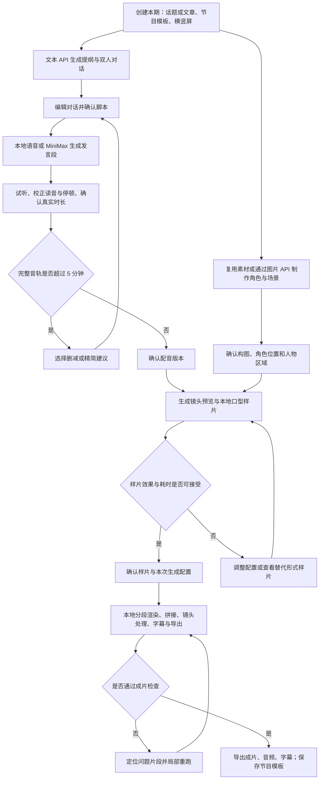

# 双声播客工坊 · 详细优化方案

## 1. 整体业务流程



## 2. 已确认约束与本方案的默认建议

### 2.1 已确认约束

| 项目 | 本次采用的约束 |
|---|---|
| 使用方式 | Windows 本地单用户工作台 |
| 目标机器 | RTX 5080；暂沿用旧文档的 16 GB 显存、32 GB 内存，开发时读取实际配置 |
| 时长 | 根据内容决定，不强制固定时长；按完整成片不超过 300 秒设计 |
| 比例 | 横屏优先，同时保留竖屏制作与导出路径 |
| 文本 | 通用文本 API；不部署本地文本模型 |
| 图片 | 图片 API；不部署本地图像生成或编辑模型 |
| 语音 | 本地语音合成为默认，兼容 MiniMax API |
| 视频 | 本地对口型生成，以 ComfyUI 工作流承载 |
| 范围 | 两位角色、离线制作；首版不开放同时说话或抢话 |

### 2.2 建议采用的产品默认值

- 五个主阶段：创建本期、编辑对话、试听配音、预览画面、生成导出。
- 三个默认确认点：脚本、配音、样片；可额外打开角色、构图和镜头确认。
- 自动时长为默认，也可选择“大约 1 / 2 / 3 / 4 分钟”；5 分钟是上限而非填满目标。
- 新建默认横屏 16:9；选择竖屏时独立检查构图，不承诺横屏素材可以无损裁成竖屏。
- 基础 SRT 字幕和可选烧录字幕进入首版，补帧默认关闭。
- 双人动态同框是主路径；替代形式列为候选，未经用户选择不自动采用。
- 首版同一期默认统一语音引擎；数据层支持每个角色绑定不同引擎，混用入口放在高级设置。

这些是本优化方案的设计建议，不将其描述成用户已逐项确认的决定。

### 2.3 对旧方案的关键替换

| 旧设计 | 优化后的设计 |
|---|---|
| 最长 10 分钟 | 完整成片最长 5 分钟 |
| 全程数据不出本机 | 工程与成片保存在本机；文本和图片请求发送到所选 API，MiniMax 启用时发送相应语音输入 |
| Ollama 与本地图像生成 | 删除部署依赖，使用独立 API 适配器 |
| 先散文稿、后分角 | 先内容结构、再直接生成双人对话 |
| 同一说话人全部连续句强制合成一段 | 按发言、情绪、语速、显式停顿与长度上限划分合成单元 |
| 等长双轨再送 add | 业务层统一等长时间轨，由工作流适配层保证不二次拼接 |
| 时间轨总长取最后一句时间码 | 以最终 PCM 音轨样本数为权威 |
| 切镜影响基础视频分段 | 尽量解耦基础视频与后期镜头，减少改镜头导致的推理 |
| 拼接阶段笼统增加重叠 | 明确渲染区间、保留区间和公共时间区间 |
| 五秒试镜代表全片已验证 | 首次工作流验证与每期代表片段验证分开 |
| 每页 done/stale 布尔值 | 产物版本与任务状态驱动页面状态 |
| 每步所有参数全暴露 | 基础选项、节目预设、高级参数分层 |

本文为独立优化提案。现有 01、02、03 和 README 尚未同步；实际开工前按第 18 节统一文档，避免混用旧契约。

## 3. 页面与交互方案

### 3.1 工程首页与节目模板

**入口**：启动工作台；任意制作页的“返回工程”。

| 元素或操作 | 展示与行为 |
|---|---|
| 最近工程 | 名称、双方角色、最后编辑时间、当前阶段、最新成片版本、是否仍有后台任务 |
| 继续制作 | 进入上次工作位置；若后台任务仍在执行，同时展示任务入口，不重复提交 |
| 新建本期 | 选择节目模板或空白工程，进入“创建本期” |
| 节目模板 | 保存角色搭配、对话风格、场景、声音绑定、镜头风格、导出规格和确认策略 |
| 保存为模板 | 复制可复用配置及已选素材引用，不携带本期台词、时间码、任务状态和旧验收结果 |
| 复制工程 | 建立新的工程身份；素材可复制复用，进行中的任务不复制 |

空工程提供“从话题开始”“粘贴文章”“使用已有脚本”三种入口。已有脚本导入属于首版低成本能力，避免强制再次经过生成。

### 3.2 阶段一：创建本期

**入口**：新建工程；制作页切换到第一阶段。

| 元素或操作 | 规则 |
|---|---|
| 内容输入 | 支持话题、粘贴文章、已有双人稿；首版不强制做网页抓取 |
| 内容要求 | 目标听众、讨论重点、双方职责、风格；模板提供默认值 |
| 时长设置 | 默认“根据内容，最多 5 分钟”；允许设置近似目标，不用字符数承诺精确时长 |
| 角色选择 | A/B 都可替换，不把 A 永久固定为系统主持人；模板可锁定避免误改 |
| 比例选择 | 横屏为默认；竖屏显示双人构图建议与后续验证要求 |
| 生成对话 | 必须有有效输入及可用文本 API；角色形象与声音未就绪不阻塞写稿 |
| 视觉准备 | 可提前进入资产抽屉选角色图、场景或上传同框底图，与内容工作独立保存 |

文本 API 不可用时保留输入，仍可导入和手工编辑脚本。切换 API 不清空内容。

### 3.3 阶段二：编辑对话

**入口**：首次生成完成；导入脚本完成；点击台词问题进入。

主要区域为对话编辑器，右侧显示内容结构和所选发言属性。技术上的句子、发言段、合成单元分层存在，用户默认编辑自然的话轮。

| 操作 | 成功结果与约束 |
|---|---|
| 编辑台词 | 自动保存新草稿；已有配音保持可听，标明不对应当前文字 |
| 增删、拖动发言 | 更新顺序；稳定 ID 不随显示序号改变 |
| 切换说话人 | 更新声音绑定与合成单元划分；显示涉及哪些现有配音 |
| 改写选中内容 | 返回候选改写及差异，用户接受后替换；其他发言不自动重写 |
| 更口语化、增加追问、减少重复 | 作为选区操作；保留原来观点和上下文角色关系 |
| 精简至目标时长 | 先给出删减建议，接受后才更新；配音后仍以实长再次检查 |
| 情绪与语速 | 默认自然语气；只显示所选语音引擎能够执行或已有明确降级解释的选项 |
| 读音词典 | 维护专名、数字、缩写的读法；显示文本与朗读文本分别保存 |
| 确认脚本 | 绑定当前脚本版本，通过后可自动启动配音 |

质量提示采用具体问题：“B 连续三次重复 A 的结论”“这一段缺少来源”“连续独白较长”。可确定的长度和占比由本地程序计算；语义判断由文本 API 提供建议，不作为事实保证。

API 流式中断时，部分内容是草稿，不把未完成 JSON 作为有效脚本。结构无效时进行一次受限修复，仍失败则保留原输出和现有稿件，提供重试与手工导入。

### 3.4 阶段三：试听配音

**入口**：脚本确认；点击现有音频；视频检查发现读音问题。

| 元素或操作 | 规则 |
|---|---|
| 语音引擎 | 默认本地；可切 MiniMax。先为双方绑定音色并做短试听，再合成整期 |
| 配音清单 | 按自然发言显示说话人、文本、生成状态、真实时长、读音或对齐问题 |
| 连续试听 | 播放完整混音；可独听 A/B；点击台词跳到对应位置 |
| 重新生成发言段 | 默认只重生成对应单元；相邻句受影响时直接显示范围 |
| 拆出一句 | 把当前句变为独立合成单元，再重新生成；不承诺与原段完全一致的音色表现 |
| 新旧对比 | 新结果先进入候选，用户采用后替换当前版本；失败不删除旧结果 |
| 调整间隔 | 拖动两次发言之间的停顿，重排时间轴，通常不重新合成声音 |
| 改句内精确停顿 | 引擎支持时使用已验证语法；否则拆分单元后本地插入静音 |
| 确认配音 | 所有使用中的音频有效、必要校正已处理、总时长未超上限；生成新的音轨版本 |

超出 300 秒时保留音频并显示超出量。提供“精简某段”“删除某段”“调整语速后试听”，不自动截尾或强行倍速。配音时长包括片头片尾发言及显式首尾停顿，后续新增片尾也要重新检查总时长。

### 3.5 阶段四：预览画面

**入口**：配音确认；准备角色与场景；调整构图或镜头。

页面包含“构图”“镜头”“样片”三个页内区域。未有配音时允许准备构图，但不能生成真实口型样片。

| 元素或操作 | 规则 |
|---|---|
| 角色图与场景 | 从资产库选择、上传或通过图片 API 生成；不要求每期重新生成 |
| 生成同框底图 | 明确引用 A/B 身份图、场景、目标比例；候选图需由人检查身份和遮挡 |
| 人物区域 | 在最终送入视频工作流的图上标注 A/B 区域；矩形框作为首版，精细笔刷后置或按效果补充 |
| 镜头预设 | 默认稳定同框，可选轻微推拉和发言人裁切；不默认每次换人必切镜 |
| 轻量预览 | 用底图、真实音轨和裁切框预览节奏，明确标记“构图预览，无动态口型” |
| 生成样片 | 自动选双方都有发言、包含 A→B→A 的区间；用户可调整范围 |
| 样片检查 | 错误开口、口型同步、角色一致、边界连续、声音与清晰度；不能只检查是否生成成功 |
| 接受样片 | 绑定本次输入版本、工作流与规格；只证明已检查区间和配置，不保证整片无缺陷 |

图片 API 失败时保存提示词和引用关系，可重试或上传替代素材。修改构图后，需要重新生成对应人物区域与样片；原图和旧样片保留作比较。

### 3.6 阶段五：生成导出

**入口**：样片确认；任务中心；历史成片。

开始前展示实际时长、比例、画面规格、语音来源、视频模式、复用段数、待生成段数、预估时间区间、磁盘预算及当前版本。没有测速数据时明确显示“尚未测定”。

| 操作或状态 | 行为 |
|---|---|
| 开始生成 | 冻结任务输入快照；相同请求连续点击只创建一项任务 |
| 当前段完成后暂停 | 停止继续派发新段，当前段完成后保存 |
| 取消当前生成 | 停止派发，尝试中断本任务持有的本地推理；已完成段保留 |
| 编辑脚本或画面 | 进入新的草稿版本；后台继续生成原快照，并明确标注版本差异 |
| 某段失败 | 保留其他段，显示错误位置；默认暂停后续串行生成，支持原位重试 |
| 导出失败 | 只重跑相应后处理或编码；不重新生成全部口型视频 |
| 成片检查 | 可定位片段、回到对应台词或镜头，记录问题并局部重跑 |
| 导出 | MP4、混音 WAV、A/B 分轨、SRT；烧录字幕可选；打开输出目录 |

关闭浏览器不停止后台。退出本地服务前提供“当前段完成后退出”和“立即取消并退出”，说明已完成内容已保存。

### 3.7 角色库、服务设置与任务中心

角色库不再是每期必经步骤。角色保存形象、性格描述、多个语音提供方的独立绑定；工程复制其已选版本，资产库更新不追溯改变历史工程。

服务设置仅分为文本 API、图片 API、本地引擎、MiniMax 语音四块。提供地址、模型/工作流、凭据引用与连接测试，不增加产品账号系统。凭据保存在机器设置，工程只引用配置 ID。

文本连通性、图片生成、图像编辑或多参考图、本地 TTS、本地口型、MiniMax 音色可用性分开显示。某一服务离线，只影响需要它的操作；用户仍可编辑和播放已有素材。

任务中心统一显示本地与 API 任务、阶段、版本、耗时、失败信息和可执行操作。任务重连从服务端读取完整状态，不能依赖浏览器之前收到的进度消息。

## 4. 内容生成与时长控制

### 4.1 两次生成，直接形成对话

第一次生成内容结构：核心问题、主要观点、必要事实、段落目的、双方职责。简单输入可自动通过这一步，不增加一个必点页面。

第二次直接生成结构化话轮，每条包含稳定 ID、说话人、显示文本、朗读文本、意图、语气和来源引用。角色意图可为解释、追问、举例、质疑、总结，不把所有 B 台词都写成“对，你说得对”。

已有双人稿只进行结构解析与校验，不默认改写。文章中的事实与模型补充的例子分开标识；来源锚点由程序根据原文位置核对，不能接受不存在的引用。

### 4.2 时长分三层处理

1. 写稿前：目标为可选偏好，上限 300 秒。
2. 写稿时：使用该角色、该提供方的历史语速估算；没有历史时标记粗估。自然发言和停顿共同计入。
3. 配音后：以真实音轨样本数确认。接近上限的稿件建议预留余量，不通过剪断声音满足限制。

最终字幕、片头片尾和片尾留白与同一节目时间轴绑定。不能只限制 TTS 总时长，再附加额外 20 秒片尾。

## 5. 系统架构与职责

```text
本地浏览器工作台
    │
本地编排服务 FastAPI
    ├─ 文本适配器 ───────── 文本 API
    ├─ 图片适配器 ───────── 图片 API
    ├─ 语音适配器
    │    ├─ LocalTTS ───── ComfyUI 或隔离的本地语音进程
    │    └─ MiniMaxTTS ──── MiniMax API
    ├─ 对齐、音轨、镜头与资产服务
    ├─ 本地视频适配器 ───── ComfyUI 对口型工作流
    ├─ 后处理 ──────────── FFmpeg；补帧可选
    └─ 工程文件、任务日志、版本和缓存
```

保留已有前端技术栈，不因本次产品调整重选框架。ComfyUI 继续负责本地模型任务，文本和图片 API 直接由编排服务调用，不强制再包进 ComfyUI 节点。

本地 TTS 优先沿用可用 ComfyUI 工作流；如果语音依赖与视频冲突，可使用隔离进程，UI 和业务接口保持一致。是否分进程由依赖验证决定，不要求第一天同时维护两套本地语音入口。

## 6. 提供方适配契约

### 6.1 文本与图片 API

通用文本 API 不等于所有协议和结构化输出能力相同。适配器负责请求格式、流式解析、错误码和结构校验，业务层只接收统一结果。

图片 API 的能力至少分开登记：文生图、单图编辑、多参考图编辑、比例限制、异步任务、取消支持、结果下载方式。连接成功不代表具备人物一致性或多参考图能力。

同框底图的首选路径是支持多参考图的编辑接口。所选服务不支持时，提供“上传已完成同框图”或“根据文字生成并人工检查”；不默默把两个人物参考图丢掉。

图片产物下载成功且可解码后才能标记完成。远程 URL 只作来源记录，本地文件才是工程资产。可用种子和模型版本随结果保存；提供方不支持确定性复现时不承诺同参必得同图。

### 6.2 统一语音接口

```typescript
type TtsRequest = {
  projectRevision: string;
  unitId: string;
  speakerId: 'A' | 'B';
  providerProfileId: string;
  modelId: string;
  voiceBindingId: string;
  displayText: string;
  spokenText: string;
  emotion: { label: string; intensity?: number };
  speedRatio: number;
  pronunciationRevision: string;
  providerOptions: Record<string, unknown>;
};

type TtsResult = {
  originalAudioAssetId: string;
  canonicalAudioAssetId: string;
  sampleRate: number;
  sampleCount: number;
  timingAssetId?: string;
  timingSource: 'provider' | 'aligner' | 'manual' | 'none';
  providerRequestId?: string;
  usage?: Record<string, number>;
  warnings: string[];
};
```

每个提供方声明是否支持音色克隆、已有音色、情绪、语速、停顿、读音词典、时间戳、流式和取消。UI 按能力渲染，不能假装某项设置生效。

统一的 speedRatio 表示大于 1 更快；适配器按具体模型参数方向换算并通过试听验证。情绪标签与本地情绪向量的映射单独维护，不能把向量直接传给 MiniMax。未支持的强度选项隐藏；不支持的语气在提交前解释其降级方式。

### 6.3 MiniMax 首版接入范围

首版建议支持：系统音色、已有 voice_id、短文本试听、按发言单元正式合成、语速与受支持的情绪、读音校正、音频落盘和时间信息归一化。新建克隆音色作为角色库中的可选操作，不作为使用 MiniMax 的前置条件。

官方 HTTP 语音入口为 `/v1/t2a_v2`，支持 `voice_setting`、读音词典、字幕开关及 hex/URL 音频结果；使用哪个域名和模型由服务配置决定。适配器同时检查 HTTP 状态与业务状态，时间戳视为候选标注而非无条件准确值。[MiniMax 同步语音文档](https://platform.minimaxi.com/docs/api-reference/speech-t2a-http)

具体处理：

1. 从服务配置读取 MiniMax 的 API 区域、地址、模型和凭据引用；不假定不同站点的音色 ID 可以互通。
2. 对两位角色分别绑定声音，使用同一段测试文本试听。
3. 首版按短合成单元使用非流式请求，应用侧以后台 Job 执行；“HTTP 同步接口”不代表页面要阻塞等待。
4. 音频解码、校验后转换为内部 PCM。保留原文件、实际请求参数、request/trace ID 和用量字段。
5. 时间信息存在时与当前 spokenText 匹配，检查范围和顺序；缺失或不可靠时转入本地对齐。
6. 不把某一 MiniMax 模型写成永远默认。提供“快速试听”和“正式配音”预设，但更换模型后重新试听。

官方另有异步创建和查询接口。五分钟节目采用短单元合成时不必首版引入长文本异步链路；未来需要时可扩展适配器，持久化远程任务 ID 后查询续跑。[异步任务创建](https://platform.minimaxi.com/docs/api-reference/speech-t2a-async-create)、[异步任务查询](https://platform.minimaxi.com/docs/api-reference/speech-t2a-async-query)

### 6.4 音色绑定与切换

角色身份、角色形象和声音绑定是三个对象。一个角色可以有本地参考音绑定，也可以有 MiniMax voice_id 绑定，但它们不保证声音完全相同。

| 场景 | 行为 |
|---|---|
| 本地切 MiniMax | 保留脚本、形象、场景；要求选择可用音色并试听；重新生成受影响角色的音频 |
| MiniMax 切本地 | 检查本地参考音或声音资产；不把 voice_id 当作本地可用音色 |
| 只有 A 切引擎 | B 的合成结果可复用；全局轨重新排布，视频按实际输入变化失效 |
| 修改声音绑定但尚未采用 | 保留当前配音为已用版本；新声音作为候选 |
| 请求失败 | 保留旧结果，不自动改用另一提供方生成同一角色剩余台词 |

需要新建 MiniMax 克隆音色时，流程为上传参考音、创建绑定、试听、正式使用。官方对克隆入口有平台认证及未使用音色保留期限等要求，界面按实际响应显示状态，不把一次创建成功等同于永久可用。[MiniMax 音色复刻文档](https://platform.minimaxi.com/docs/api-reference/voice-cloning-clone)

### 6.5 API 重试和费用控制

已成功的内容按输入哈希复用。新建生成、重新生成和恢复下载分开处理：音频或图片已经生成但下载失败时，优先恢复获取结果，避免再次付费生成。

明确的限流可退避重试；余额、权限或参数错误直接停止并显示处理入口。提交后超时且不知道服务是否已处理时，标记“结果待核实”；能查询就查询，不能查询则告知再次生成可能重复计费，不盲目无限重试。

API 预算可选设置每期上限；缺少价格配置时展示字符数、请求数和实际用量，不伪造金额。取消本地等待不代表云端任务已停止或不计费。

## 7. 语音合成单元、停顿与对齐

### 7.1 三层对象

| 层 | 用途 |
|---|---|
| 句子 Line | 编辑、字幕、读音修正 |
| 发言 Turn | 一次自然说话行为，承载角色和对话意图 |
| 合成单元 Unit | 实际送给一个语音引擎的一次请求，可以覆盖一个或多个句子 |

按说话人、语音提供方、模型、音色、明显情绪变化、语速变化、显式精确停顿与最大长度拆单元。相邻同角色且参数一致的短句允许合并。长度上限由引擎能力与试听效果确定，不固定为某个模型的极限字符数。

“更自然”和“更容易单句改动”有成本取舍。默认以自然话轮为单位，允许用户拆分；不宣称整段合成必定比逐句更保音色。

### 7.2 停顿只有一个显式归属

取消同时用前句 postPause 加后句 prePause 的双重编辑方式。每两个单元之间保存一个 transitionGapMs，首尾分别保存 leadInMs 与 tailOutMs。

保留模型自然生成的呼吸与停顿。显式间隔是额外静音，并在界面说明；若用户要求“从最后发声到下一次发声精确 0.5 秒”，需启用有预览的边界裁切，不能把模型原有尾静音和额外静音重复计算。

### 7.3 建轨算法

内部母轨建议统一为 48 kHz PCM；视频模型所需采样率由适配层派生，不反向改变母轨时长。采样率转换不能被当作音质提升。

```text
cursor = leadInSamples
for unit in orderedUnits:
    unit.offsetSamples = cursor
    将 unit 的规范 PCM 放入对应说话人轨
    cursor += unit.sampleCount
    如果后面还有单元：cursor += 当前边界的 gapSamples
N = cursor + tailOutSamples
A、B 补齐为 N 个样本
mix = 经过增益与峰值检查的 A + B
节目权威时长 T = N / sampleRate
句级全局位置 = 单元局部位置 + unit.offsetSamples
```

使用整数样本偏移避免累计浮点误差。无抢话模式检查发言区间不重叠；即使不重叠，也要检查音频本身是否削顶，不能依靠“交替说话”保证所有输入音量正常。

### 7.4 对齐顺序与质量

优先使用提供方有效时间信息；否则对合成单元执行本地对齐。faster-whisper 的转写配文本匹配与强制对齐是不同路径，页面应显示真实使用的方法。官方仓库将 WhisperX 列为提供 wav2vec2 对齐的集成方案。[faster-whisper 官方说明](https://github.com/SYSTRAN/faster-whisper)

时间信息统一映射到规范音频，并记录重采样、裁切和插入静音造成的时间变换。数字展开、英文缩写和朗读替换需要 spokenText 与 displayText 的对应关系。

质量字段至少包含：文本覆盖率、无法匹配的词、时间范围异常、待人工处理片段。提供方时间戳和 ASR 概率不共用未经校准的 0.6 阈值。手工修改时间码只更新标注，不改变实际音频。

## 8. 图片 API、人物区域与横竖屏

### 8.1 资产准备

角色参考图保留原始分辨率；场景和同框图可以通过图片 API 生成，也可上传已有素材。角色设定图是可选辅助资产，不强制每期先生成一张设定图再做同框图。

双人同框优先使用清晰可见的脸部、少遮挡嘴部的麦克风与可分离的人物区域。背景细节适度简化。人类以外角色和高度风格化角色按工作流验证结果开放，不因为有图片就默认能正确对口型。

### 8.2 坐标与比例

不再把所有原始资产锁死为 832×480。保存三类坐标：原始图坐标、规范化人物区域坐标、模型实际输入坐标，并保存确定的缩放、裁切或补边变换。

底图和 mask 使用同一几何变换。mask 使用适合其语义的采样方式，送入节点前检查尺寸、非空区域和 A/B 对应。首版人工矩形框即可验证，不把额外的本地主体检测模型设为必要依赖；精细区域按样片效果补充。

832×480 是旧候选工作流的输入规格，不是严格 16:9。首版先验证一个可用推理规格，再明确如何裁切或补边到 16:9 导出画布，不静默拉伸人物。

### 8.3 横屏与竖屏的交付路径

| 情况 | 建议路径 |
|---|---|
| 新建横屏节目 | 左右双人同框，优先稳定构图 |
| 从横屏导出竖屏 | 先展示裁切预览；人物无法同时保留时，提供上下双窗或整幅画面嵌入竖屏画布 |
| 新建原生竖屏动态节目 | 单独准备竖屏底图、人物区域与通过验证的工作流规格，再生成样片 |
| 比例在渲染后改变 | 能通过后期布局实现时只重跑后处理；更改模型输入构图时才重渲染 |

首版可以支持竖屏版式导出，但原生竖屏动态同框需单独通过验证后开放。不能把“可导出竖屏 MP4”写成“竖屏双人动态效果已达标”。

## 9. 本地视频与双人音轨适配

### 9.1 先固定业务契约

视频任务的输入为：同框底图、A/B 人物区域、两条已经按同一时间轴对齐的音轨、需生成的区间、可选前段上下文以及版本化工作流。

必须满足：

- A/B 音轨总长度一致，音频条件最终长度对应节目区间，而非两倍长度。
- A→B→A、以 B 开场、全静音短片段及只有单方发言的区间都有确定处理。
- 零幅度音频经编码不一定等同于全零音频特征；根据已知发言区间建立活动掩码，特征是否及如何清零由适配器验证，不能凭波形静音假设另一人一定闭嘴。
- 人物区域决定驱动绑定，不保证听者绝对静止。验收允许眨眼和轻微动作。

### 9.2 修正 add 假设

本次核对的 InfiniteTalk 官方脚本中，add 会串行拼接两条输入；ComfyUI 主分支的对应节点也存在内部串接行为。因此旧文档的“已经对齐的双轨 + 固定 add”不能直接作为开发接口。[InfiniteTalk 音频准备源码](https://raw.githubusercontent.com/MeiGen-AI/InfiniteTalk/main/generate_infinitetalk.py)、[ComfyUI 节点源码](https://raw.githubusercontent.com/comfyanonymous/ComfyUI/master/comfy_extras/nodes_wan.py)

实施顺序：先挑选支持时间对齐双轨的现有工作流并检查源码；没有合适实现时，评估新增独立适配节点，保持两路特征在同一时间轴上并正确处理静音。不要直接给没有该输入的节点注入 audio_type，也不要为了配合串接接口重排用户台词。

产品继续限制不抢话；底层采用并行对齐的双轨表达，并不意味着允许两人同时发言。

### 9.3 工作流版本与验证包

每套通过验证的组合保存：ComfyUI commit、节点仓库及 commit、模型文件校验值、量化方式、采样器、步数、尺寸、帧率、帧数约束、音频编码器、输入映射、依赖环境和测试样片结果。

参数注入使用节点 ID 与字段的结构化映射，不做整个 JSON 文本的字符串替换。提交前检查节点输入及类型；能力探测失败时提示修复工作流，不把参数缺失错误拖到长片中途。

IndexTTS 和 InfiniteTalk 都先作为原方案的候选，而不是将未实测的版本名、默认步数或兼容性写成已验证事实。生产工作流固定版本，升级后重跑验证集。

## 10. 分段、续接与镜头处理

### 10.1 分段不等于镜头

渲染段服务于模型时长、内存、失败重试和连续性；镜头服务于最终叙事和构图。默认以发言边界附近的自然停顿与可用模型窗口切段，不因用户调整一个推拉镜头重新生成所有基础视频。

优先由本机试验确定 5、10、15 秒等候选窗口。长业务段可以内部由多个模型窗口生成；不把“20 秒片段”误当作一次直接分配 500 帧的推理请求。

### 10.2 三个区间

每段记录：

- outputRange：该段在最终节目中负责的、不与其他保留区间重复的时间范围。
- renderRange：实际生成的范围，可能含边界缓冲。
- contextRange：续接所引用的前段画面范围，以及来源资产版本。

例如 40 秒节目：第一段保留 [0,20)，第二段保留 [20,40)；如果选择 1 秒融合，第一段可渲染 [0,20.5)，第二段渲染 [19.5,40)，共同覆盖 [19.5,20.5)。两份音频切片使用同样全局区间，融合后总长仍为 40 秒。区间在执行前转换为整数帧，示例中的半秒边界按实际帧率量化。

### 10.3 连续性策略

| 策略 | 优点 | 代价与验证 |
|---|---|---|
| 参考前段末尾帧续接 | 有机会减轻姿态跳变 | 后段依赖前段结果，修改前段可能连带重跑；需检查累积漂移 |
| 固定底图独立生成 | 易于独立重试 | 边界可能姿态复位，需要设计切点或镜头过渡 |
| 在公共时间区间融合 | 可缓和部分边界变化 | 人脸和嘴部可能重影；不是默认保证连续的办法 |

验证时比较这些路径，主工作流只选一套明确策略。必要时周期性设置重新使用底图的锚点，限制续接依赖范围；锚点附近的切换必须通过样片检查。

固定种子保存以便追溯，不能代替连续性验证。基础种子使用稳定片段 ID 派生，避免插入一段后所有后续段因为编号变化而无意义换种子；跨硬件或云端也不承诺位级复现。

### 10.4 帧数与最终时长

使用整数帧作为视频坐标，采样点和帧之间通过同一个转换函数映射。模型若要求特定帧数形式，先补足合法输入帧数，输出后去除额外上下文与补齐帧。

验收要求最终帧覆盖完整音轨且误差小于一个输出帧，不遗漏首尾语音。连续片段不能每段各自四舍五入后累积误差；从全局边界统一推导。

### 10.5 后处理顺序

基础视频完成 → 按保留区间与连续性策略合成 → 应用镜头裁切和版式 → 可选补帧 → 可选烧录字幕 → 合并权威音轨并编码 → 校验导出。

SRT 独立从校正后的时间信息生成，显示文本不包含引擎专用标签。补帧在字幕烧录之前执行，并以镜头边界分开处理，避免跨硬切生成过渡帧。最终音频只合并一次，不把模型生成的分段音轨再次混入。

## 11. 样片验证与替代形式

### 11.1 首次工作流验证

先做双轨时序的无 GPU 契约检查，再做短样片，再做 30–60 秒跨段验证，最后验证接近 5 分钟的完整节目。覆盖数字、英文缩写、短追问、长发言、A→B→A、B 开场、停顿、片尾。

视频侧统一先使用一套质量合格的音频，避免同时调整声音与视频无法定位问题；本地 TTS 与 MiniMax 的效果差异在音频测试中独立比较。

### 11.2 每期样片

自动选择双方都有发言的代表区间，初始建议 10–20 秒，实际按台词确定；另提供相邻分段的边界预览。复用同一节目模板能减少素材准备，但新音频仍需验证。

如果样片与正式片段具有完全相同的输入、参数、上下文和区间，可复用结果；低规格快速样片不能充当高规格正式片段，也不能无条件继承正式质量认证。

### 11.3 替代形式候选

| 形式 | 适用与限制 |
|---|---|
| 双人动态同框 | 主目标，需验证双人绑定、连续性和耗时 |
| 发言人单人动态镜头 + 双人静态全景 | 可回避部分双人驱动问题；属于镜头语言变化，先出样片再选择 |
| 双窗版式，发言者动态、听者静态 | 横竖屏都较容易排版；视觉上更像远程访谈，需要单独评价 |
| 静态画面 + 配音 + 字幕 | 可作为先行交付或用户主动选择的模式；不冒充动态视频完成 |

替代形式不一定更快：切换模型、不同分辨率和额外镜头都可能增加耗时，必须同机测量。动态模式失败后只显示候选和预估，用户选择后生成对比样片，不自动改变节目形式。

## 12. 缓存、版本和局部重跑

### 12.1 核心数据对象

| 对象 | 必要字段或职责 |
|---|---|
| Project | schemaVersion、工程 ID、当前草稿版本、已选成片版本 |
| ScriptRevision | 原始输入版本、话轮与句子、角色职责、文本 API 生成配置 |
| VoiceBinding | 角色、提供方配置 ID、模型、参考音版本或 voice_id、试听状态 |
| SynthesisUnit | 稳定 ID、对应句子、提供方配置、已采用音频版本 |
| AudioTimeline | sampleRate、sampleCount、单元偏移、显式间隔、标注版本 |
| VisualVariant | 原图、比例、模型输入变换、A/B 区域、图片生成配置 |
| ShotPlan | 镜头区间、裁切或版式；人工固定镜头与自动镜头分开保存 |
| RenderSegment | 保留/渲染/上下文区间、输入哈希、父上下文资产、有效输出版本 |
| Artifact | 类型、相对路径、文件哈希、依赖哈希、参数及工作流版本、验证结果 |
| Job | 输入快照、阶段、状态、提供方任务 ID、attempt、结果、恢复策略 |
| Approval | 确认类型、确认的输入版本和规格；不只是一个全局布尔值 |

### 12.2 缓存键

音频缓存键包含实际朗读文本、声音绑定、模型、合成参数、读音词典和适配器版本。字幕显示文字的标点修改如果不影响朗读输入，不应触发 TTS。

基础视频缓存键包含底图、人物区域、该段实际音频内容、活动区间、输入规格、工作流与上下文资产。全局起始时间变化但局部内容和上下文完全一致时可以复用，再更新时间位置；不能仅凭“段 ID 相同”就复用。

后期缓存键包含已选视频资产、镜头、版式、字幕、输出规格。检查哈希以外，还必须检查结果文件存在且可解码。

### 12.3 重跑矩阵

| 改动 | 音频合成 | 时间轨/标注 | 基础视频 | 后处理 |
|---|---|---|---|---|
| 改台词的实际读法 | 对应单元 | 对应标注及后续偏移 | 变化区间及其上下文依赖 | 相关输出 |
| 只改字幕标点 | 否 | 字幕文本版本 | 否 | SRT 或烧录字幕 |
| 改显式发言间隔 | 否 | 重排 | 实际输入变化的段及依赖 | 是 |
| 改 A 的声音 | A 的单元 | 重新建立相关偏移 | 音频变化区间及依赖 | 是 |
| 只改时间标注 | 否 | 是 | 否，除非重新采用的分段计划改变输入 | 镜头与字幕相关部分 |
| 改底图/人物区域 | 否 | 否 | 对应视觉版本的段 | 是 |
| 改数字推拉/裁切 | 否 | 否 | 否 | 镜头处理及导出 |
| 开关烧录字幕 | 否 | 否 | 否 | 字幕与编码 |
| 改编码规格 | 否 | 否 | 通常否；改变推理规格除外 | 编码或版式 |
| 换模型或工作流 | 对应引擎产物 | 按实际影响 | 对应产物 | 对应下游 |

续接模式的段必须把前段上下文作为依赖。不能一面承诺跨段连续，一面承诺任何前段修改都绝不影响后段。

### 12.4 草稿、候选和已用版本

编辑创建草稿，生成返回候选，采用操作更新当前使用版本。人工模式下保留比较机会；自动模式按已保存策略采用结果。任务结果到达时若当前草稿已变化，只加入历史并标记所属版本，不覆盖新草稿。

步骤状态由其需要的产物推导：未准备、可执行、执行中、待确认、已就绪、已过期、失败。点击“下一步”仅导航，不写入虚假的完成状态。

## 13. 任务调度、恢复和 Windows 运行

### 13.1 调度资源

- GPU 队列：本地 TTS、视频、使用 GPU 的对齐、补帧共享排他资源。
- API 队列：文本、图片、MiniMax 按提供方限流配置并发，不占 GPU 锁。
- CPU/磁盘队列：解码、对齐和后处理限并发，避免 32 GB 内存与磁盘被同时挤满。
- 优先级在任务或片段边界生效，试听任务不能无损抢占正在执行的 GPU 采样。
- 从 TTS 切视频时检查模型卸载与资源释放；“串行请求”不自动代表上一模型已经释放显存。

### 13.2 持久化与恢复

首版保留工程文件方案：project.json 存工程索引，jobs 存任务快照与事件，artifacts 存产物清单。所有元数据由后端单一写入入口维护，采用临时文件、原子替换和可恢复事件记录。

Job 推荐状态：queued、running、pause_requested、paused、waiting_confirmation、recovering、succeeded、failed、cancel_requested、cancelled、unknown。正在取消和已经取消分开；前端断线不修改后端执行状态。

启动恢复顺序：

1. 扫描未结束任务与执行尝试记录。
2. 检查已落盘输出是否完整及对应输入快照。
3. 对有 ComfyUI prompt_id 的任务查询队列/历史；还在运行则继续跟踪，已完成则恢复取结果。
4. 对有远程任务 ID 的 API 任务使用提供方查询能力；不支持查询且结果不明的请求标记 unknown。
5. 确认未提交或确定失败后才允许重新派发；不把旧 running 一律变成 queued。

任务提交前记录尝试意图，提交后立即记录提供方 ID。两者之间崩溃会留下不确定窗口，不能声称本地哈希能保证外部 API 恰好执行一次；必须有 unknown 处理。

### 13.3 ComfyUI 任务归属

首选供工作台管理的专用 ComfyUI 实例。若接用户已有实例，检查当前 prompt 是否属于本应用；不能因用户取消一期节目而中断其他工作流。没有可验证的定向取消能力时停止后续派发并等待当前任务结束，明确显示“取消待生效”。

进度分为准备、推理、下载/落盘、校验、后处理。节点进度映射为阶段进度，不能当作精确剩余时间。实际 ETA 使用同规格历史测量。

### 13.4 本地启动与存储

交付一个启动入口：检查配置和服务 → 启动必要本地进程 → 打开工作台。前端构建产物由本地服务提供，日常使用不要求手动运行 Vite。

Python 环境按编排与推理隔离，固定验证通过的依赖组合。启动自检实际驱动、GPU、可用显存/内存、模型和磁盘，不直接把旧文档的驱动版本视作当前机器事实。

路径用结构化参数传给子进程，支持中文和空格。临时输出完成校验后再纳入产物清单。清理按引用关系回收，不删除进行中任务、当前成片和保留版本引用的文件；清理前展示可释放空间。

## 14. 内部接口与目录建议

### 14.1 业务接口

| 接口 | 用途 |
|---|---|
| GET /api/providers/capabilities | 返回各配置的实际能力和就绪状态 |
| POST /api/providers/{id}/test | 按能力测试；付费试听与只读连通检查区分 |
| GET/PATCH /api/projects/{id} | 读取/保存草稿，携带 expectedRevision 防止旧页面覆盖新状态 |
| POST /api/projects/{id}/script/generate | 创建内容生成 Job，结果为候选脚本版本 |
| POST /api/projects/{id}/script/rewrite | 选区改写并返回差异 |
| POST /api/projects/{id}/tts/preview | 指定声音绑定生成短试听 |
| POST /api/projects/{id}/tts/synthesize | 指定合成单元及输入快照 |
| POST /api/projects/{id}/audio/assemble | 构建音轨与校正时间信息 |
| POST /api/projects/{id}/visual/generate | 图片 API 任务，明确生成或编辑能力 |
| POST /api/projects/{id}/rehearsals | 创建样片任务 |
| POST /api/projects/{id}/renders/plan | 返回可复用与需重算产物、估算和阻塞项 |
| POST /api/projects/{id}/renders | 提交计划版本及输入快照 |
| POST /api/approvals | 确认明确的任务、关卡、产物版本 |
| GET /api/jobs/{id} | 读取任务完整状态 |
| POST /api/jobs/{id}/pause 或 /cancel | 请求暂停或取消，返回真实状态 |
| GET /api/events | 订阅带序号的进度事件；重连可补发或读取完整快照 |

渲染计划生成后若输入发生变化，提交旧计划需要明确使用旧版本或重新规划。不能显示“只重跑 2 段”，提交时实际使用新输入重跑 10 段。

### 14.2 工程目录

```text
project/
  project.json
  revisions/                  # 脚本、声音绑定与配置快照
  assets/
    characters/
    images/original/
    images/model-input/
    masks/
  audio/
    original/                 # 提供方原始音频
    units/                    # 规范 PCM 单元
    timelines/                # 分轨、混音与标注版本
  shots/
  rehearsals/
  render/
    plans/
    segments/
    post/
  artifacts/
  jobs/
  logs/
  output/
  tmp/
```

正式产物使用不可变版本路径，不覆盖同名 final.mp4 后让历史仍指向它。工程存相对路径，配置存机器级凭据引用；打包工程包含所选产物与依赖，避免复制临时缓存和 API 密钥。

## 15. 首版范围与后续范围

| 首版必须交付 | 首版可选或后置 |
|---|---|
| 五阶段制作与可独立进入的资产库 | 全功能专业时间线编辑器 |
| 文本 API、图片 API 各一套实际可用适配器 | 大量提供方一次性接入 |
| 本地 TTS 与 MiniMax 系统/已有音色合成 | 高级音色设计、批量声音管理 |
| 读音修正、分段试听、重生成与版本比较 | 逐音素编辑、复杂声音效果 |
| 真实时间轴、对齐问题处理、300 秒上限 | 多语言翻译和配音 |
| 双人动态同框验证与稳定工作流 | 多人、抢话、复杂运动镜头 |
| 横屏主路径、竖屏版式导出 | 未经验证的原生竖屏高规格动态承诺 |
| 分段恢复、输入版本、缓存失效 | 跨机器分布式渲染 |
| MP4/WAV/SRT、可选字幕烧录 | 默认补帧、花字、复杂片头包装 |
| 三确认点与模板自动执行 | 多工程无人值守批量生产 |

不部署本地文本或图像生成模型，不建设多用户账号体系。MiniMax 云端音色新建可作为后续小迭代，不阻塞首版对现成音色的兼容。

## 16. 开发路线与验收

### 16.1 按交付关口实施

| 阶段 | 交付物 | 进入下一阶段的条件 |
|---|---|---|
| A. 工作流验证 | 双轨适配检查、短样片、跨段样片、硬件实测记录 | 正确驱动双方，分段不丢时间，质量和耗时可评估 |
| B. 最小生产闭环 | 已有脚本 → 本地/MiniMax 音频 → 上传底图 → 视频 → 导出 | 至少一条接近 5 分钟的完整片通过验收；失败恢复有效 |
| C. 内容与图片 API | 提纲与对话、局部改写、角色与场景 API、资产复用 | 两类 API 的失败不丢工作；同框图可生成或可替换上传 |
| D. 五阶段编辑工作台 | 全流程页面、时间轨、镜头、版本与影响提示 | 局部修改不会无意义重跑整个工程 |
| E. 自动执行与交付 | 模板、确认点、后台恢复、启动器、字幕和竖屏版式 | 用同一模板连续制作多期，操作与产物一致 |

任务快照、产物哈希与持久化从阶段 B 开始实现，不能拖到自动化阶段再补。五分钟测试不能只把某个短片复制多次，应覆盖真实多话轮与至少一次长片中途恢复。

阶段 A 没通过时继续调整工作流或评估候选形式，不先做完全部页面。排期在 A 后按实测与可用节点重新估算；旧九周计划不作为当前承诺。

### 16.2 验收用例

| 验收项 | 最低通过标准 |
|---|---|
| 双轨时序 | A→B→A 与 B 开场均正确；视频条件不二次拼接或翻倍 |
| 单方发言与静音 | 静音区间不报错；另一角色无明显持续错误开口 |
| 发言参数 | 单独修改语速、情绪、停顿有可听见且范围准确的结果 |
| 声音来源切换 | 本地和 MiniMax 结果进入同一时间轨和视频管线，已有资产保留 |
| 对齐 | 所有句子覆盖有效音频区间，低质量部分可定位、试听和人工修正 |
| 五分钟限制 | 实际总音轨及附加时长超过上限时可精简，无截断尾句 |
| 边界 | 无重复或丢失台词；拼接处无明显双脸、跳姿和音画累积偏移 |
| 音画时间 | 整片视频与母轨长度误差小于一个输出帧；局部口型误差人工检查 |
| 局部重跑 | 改裁切不触发 TTS/基础视频；改一句仅重合成相关单元，并正确传播续接依赖 |
| 中断恢复 | 关闭页面、重启编排、单段失败、输出下载失败都可恢复且不丢有效结果 |
| 版本隔离 | 旧任务完成不覆盖新草稿；旧成片可以独立播放和导出 |
| 路径与磁盘 | 中文/空格路径可运行，磁盘不足在开始前或落盘时明确报告 |
| 横竖屏 | 横屏成片无拉伸；竖屏版式不误切另一位角色、不遮挡关键字幕 |
| 字幕 | 不显示情绪/读音控制标签，时间戳合法，开关字幕只影响对应后处理 |

口型与身份质量先使用人工检查，不凭单一自动评分宣布通过。接近五分钟的测试需完整观看，不能只看开头和结尾。

### 16.3 性能记录

同机分别记录冷启动与热启动、TTS 耗时、视频生成秒数与实际墙钟时间、模型加载、重叠额外生成、峰值显存/内存、后处理、失败次数和磁盘占用。

视频倍率 R = 实际视频推理墙钟时间 / 实际生成的视频秒数。若 R=10，300 秒的纯推理量约为 50 分钟；若 R=20，约为 100 分钟，均未包含额外重叠、模型加载和其他步骤。这只是计算示例，不是 RTX 5080 的测速结果。

工作台显示依据本机同规格样本计算的区间，不直接沿用旧文档的分钟数。是否“耗时达标”需拿实测结果与用户愿意等待的时间比较。

## 17. 决策状态与接入时需要的信息

当前可以继续完善方案和搭建适配结构，没有必须现在阻塞的产品问题。

| 项目 | 当前处理 | 何时需要确定 |
|---|---|---|
| 五阶段、三确认点 | 作为推荐方案写入；高级配置可保留更多检查点 | 页面方案定稿时 |
| 替代视频形式 | 只设计候选，不自动降级 | 主路径实测不达标后，查看对比样片再选 |
| 可接受渲染时长 | 不虚设硬门槛，先记录本机速度 | 第一轮样片测速后 |
| 文本 API 服务与模型 | 使用提供方适配接口 | 联调前提供服务名称、地址和模型 |
| 图片 API 服务与模型 | 特别核实多参考图编辑能力 | 联调前明确，可暂用上传图片跑通本地链路 |
| MiniMax 音色 | 首版支持系统/已有 voice_id；新建克隆可选 | 联调时选择双方声音和对应平台配置 |
| 原生竖屏动态 | 不影响横屏主路径和竖屏版式导出 | 原生竖屏工作流测试通过后 |

接口凭据在本机设置中填写即可，不需要写进方案正文。

## 18. 现有文档同步清单

确认采用本方案后，按以下顺序同步已有文档：

1. README：替换五分钟边界、API/本地分工、五阶段导航、MiniMax 支持与验证状态；删除“全程不出本机”、Ollama 和本地图像模型依赖。
2. 页面详细设计：用五阶段主界面重组现有能力；资产库独立；修正完成状态、声音切换、重跑范围、样片版本和三确认点。
3. 实施方案：替换双轨 add 假设、音频样本时长、分段区间、工作流参数映射、产物依赖和任务恢复契约；重写模型清单与性能预算。
4. 方案总览 HTML：从更新后的两份文档同步内容，不继续维护第三套独立算法描述。
5. 旧版页面说明书继续作为历史参考，入口明确标注不可直接用于开工。

同一规则只保留一个权威定义，其他文档引用章节。特别是“时长公式、双音轨输入、失效矩阵、确认策略”不得继续在多处各写一版。

本方案中的官方 API 与源码事实为本次文档核对结果；实际服务、节点与模型版本仍应在联调时锁定。本文未执行收费生成，也未在目标 RTX 5080 上运行推理，不将候选工作流或性能数值标为实测通过。
