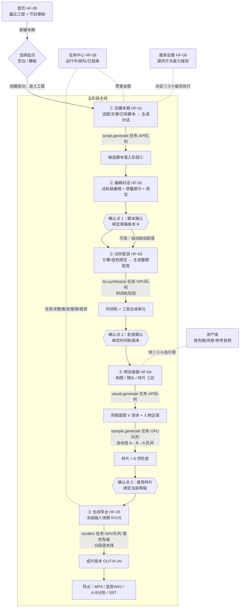

# 13 · 全流程图与界面说明（当前实现版）

> 依据：01 页面设计 + 02 实施方案 + 当前代码（v3.2，提交 92d2b65）。
> 用途：逐屏核对「方案行不行」——每个界面画了什么、用户能做什么、系统背后发生什么、出错会怎样。
> 标注约定：〔演示〕= mock 阶段占位，真实引擎接线后行为不同；✅= 已实现并可操作。

---

## 0. 一张图看整个流程

三个确认点（脚本 / 配音 / 样片）都是**审批记录只追加、绑定具体版本**——后续任何上游修改都产生新草稿版本并要求重走对应确认，绝不静默覆盖已用内容。

---

## 1. 首页（HF-00）

**用户系统长什么样**

| 区域 | 内容 |
|---|---|
| 顶栏 | 产品名 · 「导入工程」 · 「新建本期」 |
| 主体左 | 「最近工程 N 个」卡片列表：工程 ID+标题、A/B 角色、当前阶段徽章（①~⑤+阶段名）、最后编辑时间、「继续制作」、⋯更多操作（重命名/删除等） |
| 主体下 | 「节目模板 N 个」卡片：角色配置摘要 + 风格/比例/引擎/确认点标签 · 「用此模板新建」「保存为模板」「新建模板」 |

**步骤语义**：点「新建本期」→ 弹窗选起点（空白工程或某模板）→「创建」→ `POST /api/projects` → 直接进入阶段①。模板只带入可复用配置与素材引用，不带内容。〔演示〕首页工程卡上的阶段徽章由服务端权威推导（stage_svc），不是前端猜的。

---

## 2. 阶段① 创建本期（HF-01）

**布局**：左 55%「内容输入」卡 / 右 45%「内容要求」卡；无检查器、无时间轴（脚本确认收口在②）。底部 FootBar 提示「阶段① 无确认点」。

**左卡 · 内容输入**
- 三个来源 Tab：**从话题开始**（≤200字提示）/ **粘贴文章**（≤8,000字，超限黄条警告）/ **已有脚本**（只做结构解析校验）。
- 「生成对话」按钮：内容为空或文本 API 未就绪时禁用；不可用时给「文本 API 不可用 → 去服务设置」引导。
- 点击后进入两步进度：`内容结构 →（箭头）→ 结构化话轮`，带流动进度条与「取消」按钮；完成变绿卡「候选脚本已生成 + 草稿版本号 + 前往编辑对话」；失败变红卡「生成失败 + 错误原文 + 查看任务中心 + 重试生成」。

**右卡 · 内容要求**
- 节目名（失焦即 PATCH）、时长（自动「根据内容最多5分钟」/ 大约 1–4 分钟按钮组 +「偏好不是承诺」注记）、比例（横屏 16:9 / 竖屏，改动立即 PATCH）、角色区（角色图从资产库选或 API 生成；「形象与声音未就绪不阻塞生成对话」）。

**背后发生什么**
- `POST /api/jobs/script.generate`（clientToken 幂等，queueClass=**api**，并发上限 16）。
- Worker：调文本提供方 → 产出 `ScriptRevision R…`（服务端十六进制 ID）→ 写回工程 `currentDraftRevision`，revision+1。
- 刷新/断线后：任务卡状态从服务端重读（本 session 修复的 P0 就是这里的过滤：工程间任务不再串台）。

**核对点**：文章→对话是一次生成还是两步可见？——UI 展示「先内容结构，再结构化话轮」两步，但真实粒度取决于文本提供方实现（关口 A 后验证）。

---

## 3. 阶段② 编辑对话（HF-02）

**布局**：左侧单列话轮列表 + 底部统计条；右侧检查器（内容结构 / 所选发言 / 质量提示）。顶栏徽章「草稿 R… · 未确认」或「脚本 R… · 已确认」。

**话轮卡片**：`#T01` 稳定 ID + 说话人徽章（A·主持 / B·嘉宾）+ 意图下拉（解释/追问/举例/质疑/总结/其他）+ 正文（可双击编辑，显示文本/朗读文本分离）+ 语气/语速摘要 + 上移/下移/删除；拖动手柄排序，**稳定 ID 不随显示序号改变**。列表下方「+ 发言」新增话轮。

**检查器**
- 内容结构：核心问题/主要观点/必要事实/双方职责（来自生成结果，可为「—」）。
- 所选发言：说话人 A/B 切换、意图、语气、语速 ±0.05（0.5–1.5）。
- 质量提示（本地计算）：连续独白较长（>90字，**「拆分」按钮真实切分**，本轮新修）、缺来源锚点、读音 N 处（入口→读音词典：专名/数字/缩写，显示与朗读分别保存）、AI 建议（连续重复开头）。
- 选区工具条：多选话轮 → 改写/更口语化/增加追问/减少重复/精简至目标时长 → `script.rewrite` 任务（api 队列）→ 完成后弹「候选」，可接受（覆盖所选话轮）或丢弃。

**保存与确认语义**
- 自动保存 2s 防抖 → PATCH 草稿 upsert；状态条「未保存/保存中/已保存/保存失败」，确认与改写前强制 flush。
- **编辑分岔规则**：基版本=当前草稿且未确认且在列表尾部 → 原位替换；否则（已确认/查看历史版本时编辑）→ **新建草稿版本 R1、R2…**，不覆盖已用版本。
- 「确认脚本」= 确认点 1：`approvals +{kind:script, inputRevisionId:R…}`；已确认后若再编辑产生新草稿，头部出现黄条「已绑定脚本 R…。编辑将创建新草稿版本…」+「前往阶段③」快捷。确认后可选自动启动配音。

---

## 4. 阶段③ 试听配音（HF-03）

**布局**：左「语音引擎 + 话轮清单」，右检查器（所选发言 / 间隔调整 / 高级 / 依赖提示）；顶部时间轴条显示时间轨版本+总时长。

**引擎区**：本地引擎（默认）/ MiniMax 单选——切换即换 providerProfileId 且要求重新试听；A、B 两行各含：音色下拉（CosyVoice2 参考音/增强/低沉…）、「选择参考音频」（本机文件，只存引用）、「试听」（提交 tts.audition 任务；mock 无产物时明确提示，真实 TTS 可播）、「生成整期配音 / 重新生成整期配音」。

**话轮清单**：每话轮展示文本 + 读音命中（如 `读音：1 处（GB）`）；合成后每单元有「连续试听 / 独听A / 独听B」〔演示禁用〕、点击台词跳位置。

**检查器 · 间隔调整**：滑杆改 `transitionGapMs`（0–1200ms，定位到**所选单元的真实相邻区间**）；「通常不重新合成声音」，只重排时间轴。句内停顿按钮在引擎不支持时拆单元后本地插静音〔演示禁用〕。

**状态与失效（本 session 实测走通）**
- 合成 = `tts.synthesize` 任务（**gpu** 队列，上限 1，天然串行）→ 完成后写回 `audioTimeline`（units=三层合成单元、unitOffsets、sampleRate 权威）+ 阶段徽章。
- 上游脚本改动后进入本页：黄条「时间轨对应 R1，当前草稿 R2；脚本已改动，请重新生成整期配音后再确认（旧时间轨保留在音频历史中）」，按钮文案自动变「重新生成」。
- 增删话轮后合成不再被 INVALID_GAPS 卡死（本轮修复：间隔数组按当前话轮数重采样）。
- 「确认配音」= 确认点 2，绑定**时间轨版本**；重新合成会撤销 voice/sample 确认并回到待确认（写回规则，防旧确认配新音频）。

**核对点**：试听按钮全部禁用直到真实 TTS 接入——演示模式只能「合成→看时间轨数字」，**听不到声音**。这是当前方案对用户最大的体验空洞，关口 A 前无法绕过。

---

## 5. 阶段④ 预览画面（HF-04）

**布局**：三个功能区（构图/镜头/样片，Tab+页内锚点滚动），顶栏「视觉 V01 · 待接受/已用」，右上「接受样片」按钮 + 条件说明。

**构图区**：「生成同框底图」→ `visual.generate`（api 队列）→ 画布上出底图 + **A 区/B 区人物区域标注**（归一化坐标）+ 主图变体列表（V01·横屏/V02…，多候选选一）；场景（录音棚·资产库 / 生成新场景 / 上传〔禁用〕）、角色 A/B 资产引用。竖屏 Tab 切 9:16 提示构图。

**镜头区**：定位「后处理 · 改镜头不触发基础视频重渲染」；预设单选：稳定同框（默认）/ 轻微推拉 / 发言人裁切，复选 轻微推拉/发言人裁切；「轻量预览」= 构图预览，无动态口型〔需选中变体〕。

**样片区**：区间自动选取「双方都有发言、含 A→B→A 的连续区间」（配音未确认时显示「待配音确认后自动选取」，按钮禁用——**不让你跳过③**；话轮不足 3 条时明确提示回②调整）；「生成样片」→ `sample.generate`（gpu 队列，mock 为演示任务、无可播放片段）→ 5 项人工检查勾选：**错误开口 / 口型同步 / 角色一致 / 边界连续 / 声音与清晰度**（另有「边界预览」按钮）；全勾后「接受样片」解禁 → 确认点 3（服务端校验绑定当前草稿，过期确认 422）。固定免责文案：「接受样片只证明已检查区间和配置，不保证整片无缺陷」。

**核对点**：样片 6 项目前是**人工勾选**（mock 无真实样片可看）；真实引擎接入后这里必须变成「可播放的 8–15s 片段 + 勾选项对应可核证据」，否则确认点 3 形同虚设（12 报告已列为下一批 P0）。

---

## 6. 阶段⑤ 生成导出（HF-05）

**布局**：顶部输入快照行「R2 / V01 / S1 · 未冻结→点击开始生成时冻结」；左提交区；右分段进度 + 导出选项。

**提交区**：黄色警示常驻「当前为流程演示，不生成 MP4/WAV/SRT」〔演示〕；「开始生成前确认」摘要卡（估算时长、画布 854x480、语音来源=模拟语音、视频模式=双人动态同框、分段 复用0·待生成1、预估/磁盘预算）；主按钮「运行流程演示」（真实引擎后为「开始生成」）。

**分段进度**：七步流水线文案（基础视频 → 保留区间合成 → 镜头裁切与版式 → 可选补帧 → 可选烧录字幕 → 合并音轨 → 编码 → 校验），分段卡 `#01 片头 0:36.7 · 口型视频 · 480p`，状态待生成/运行/复用。

**导出区**：MP4（480p H.264）/ 混音 WAV（48000Hz，样本次数权威）/ A·B 分轨 / SRT（显示文本不含引擎标签）/ 烧录字幕开关；「打开输出目录」；未生成成片时「导出」禁用。

**背后**：`renders` 任务（gpu 队列 + **priority=10 插队**，12 报告 C-1）；真实成片验证落盘后登记 `OUT-{revision}-vN`（当前 mock 不登记假版本，返回 `DEMO-R2-J…` 明说无文件）；下游改脚本 → `render` 阶段推导为 STALE（OUT 版本内嵌 revision 比对，本轮新增）。

---

## 7. 任务中心（HF-08）与横切系统

**布局**：三分组同屏——运行中（含暂停/待确认/unknown）、排队（显示「等待 gpu 队列 · 第 N 位（按优先级与提交顺序）」，本轮新增）、已结束（今日）。每卡：状态圆点（●/○/✓!/⏸）+ 类型名 + 任务 ID + 队列 class + 耗时（终态=finishedAt-createdAt，进行中=now-createdAt，不冒充）+ **五阶段语义进度条**（准备/推理/下载落盘/校验/后处理）+ 卡内按钮（操作对象=本卡，不依赖选中态）。右侧检查器：所选任务全字段、五阶段明细、取消语义说明、输入快照（冻结 JSON）、结果 JSON。

**操作语义**：暂停=协作式（当前段完成后生效，显示「当前段完成后暂停」，paused 变「继续」）；取消=保留已落盘内容可续跑；**UNKNOWN 任务 = 「无法恢复 · 放弃记账」按钮**（abandon→FAILED，本轮新增，堵死挂起黑洞）。

**并发模型**：GPU(1)/API(16)/CPU(4) 三队列（`DUOCAST_QUEUE_*` 环境变量可调）；同队列内按 (priority, createdAt) 最小堆出队，同级 FIFO；clientToken 幂等（重复提交返回同一任务，实测）；SSE 事件带序号，断线补发不连续→ `system.resync`→前端整读快照；重启自检 recover + 事件序号续接。

---

## 8. 失效传播矩阵（改上游会发生什么）

| 你改了 | 直接 | 级联（自动标记，需你重新走） |
|---|---|---|
| ② 编辑已确认脚本 | 新草稿 R+；脚本确认对新 R 失效 | ③ 时间轨过期黄条+强制重新合成；voice/sample 确认随重合成撤销；⑤ render 若已有 OUT 版本→STALE |
| ③ 重新合成配音 | 时间轨替换（旧入音频历史）；voice 确认回到待确认 | ④ 样片区间随新时间轴重算；sample 确认撤销 |
| ④ 重新生成底图/换变体 | 新 V 变体「待接受」 | ⑤ 快照 V 位更新，需重新接受样片链 |
| ④ 只改镜头预设 | 基础视频不重渲染（后处理层） | 仅样片需重出〔真实引擎后强制〕 |
| 未确认就点下一步 | 下游入口禁用（如③未确认→④样片按钮禁用；④未接受→⑤下一步禁用） | — |

---

## 9. 当前「演示模式」与真实方案的差距（判断行不行的关键）

| 环节 | 现在（mock） | 目标（真实引擎，见 12 报告 §6） |
|---|---|---|
| ① 对话 | 规则法切文章 | DeepSeek/本地 LLM，真实双话轮改写 |
| ③ 配音 | 只产样本次数，**听不到** | CosyVoice2 本地 / MiniMax API，试听+分轨可听 |
| ④ 画面 | 假底图+假样片，检查=盲勾 | Qwen-Image-Edit 底图 → InfiniteTalk 双人分段口型 → lightx2v 8步+TeaCache → 镜头层 ffmpeg → SeedVR2 放大（5080 16G，fp8/GGUF） |
| ⑤ 渲染 | DEMO- 结果字符串 | 分段真渲染+断点续跑，OUT 版本登记，MP4/WAV/SRT 落盘 |
| 队列 | 已按三队列+优先级实装 | ComfyUI 作为 GPU worker 的执行后端接入（提交/轮询/取消映射到 Job 状态机） |

**结论行不行的一句话版**：流程骨架（五阶段、三确认点、版本绑定、失效传播、排队/幂等/恢复）已按真实生产标准立住且全链路走通；当前空洞集中在「③④⑤没有可听可看的产物」，即关口 A/B（硬件实测+真实适配器）未过——方案结构不需要推翻，缺的是引擎接线与对应 UI 证据化（样片可播、检查有据）。

---

## 10. 建议你按这个顺序人工核对

1. 首页新建 → ①贴一段真文章 → 看候选话轮是否像「人话」（规则法短板会很明显）。
2. ②拆一条长独白、改一个说话人、跑一次「增加追问」改写 → 看候选弹层与接受。
3. ③确认配音后回②再改字 → 看黄条与强制重合成（本轮实测通过）。
4. ④走完 6 项检查接受 → ⑤跑演示 → 任务中心看三队列卡与排队位次。
5. 关掉服务进程再开 → 首页任务状态、事件流是否无损（恢复自检）。
